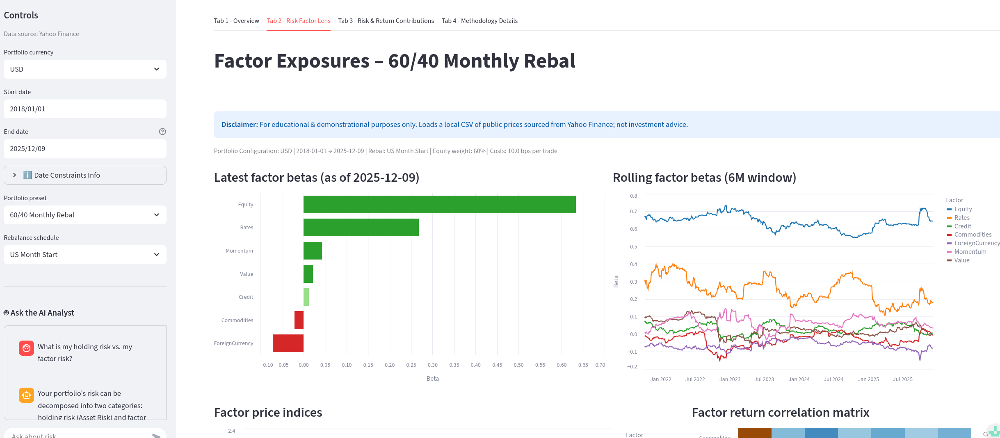

# Cross-Asset Monitoring Dashboard




A compact Streamlit dashboard for monitoring a multi-asset portfolio
through performance, factor exposures, and risk contributions.

Entry point: `main.py`.

See `changelog.md` for a concise history of notable changes and the initial v0.1.0 snapshot.

This project was built to demonstrate a practical, transparent
cross-asset monitoring workflow with a compact orthogonalized risk factors hierarchy,
exposure estimation, and factor-based risk decomposition.

A main motivating reference for the workflow design is this article on
integrating historical portfolio and factor analysis into monitoring practices:
[Incorporating Historical Portfolio Analysis into your Workflows](https://www.venn.twosigma.com/resources/incorporating-historical-portfolio-analysis-into-your-workflows)


---

## What you can do with the dashboard

- Backtest a simple long-only portfolio with rebalancing (concise preset setup).
- Monitor weight drift vs target.
- View latest and rolling factor betas.
- Decompose portfolio risk and return into asset- and factor-level contributions.
- Review the methodology directly inside the app.
- Chat with an AI agent to explain the methodology behind and definitions.

---

## Orthogonalization in the Factor Risk Engine 

The core design choice in this project is a compact **parent–child factor
hierarchy** with **orthogonalization (residualization)**.

The factor set is intentionally small and cross-asset (Yahoo Finance tickers are used as proxies):

- **Equity** (`VT`)
- **Rates** (`IEF`)
- **Credit** (`LQD`)
- **Commodities** (`GSG`)
- **Foreign Currency** (`UDN`, triangulated when needed)
- **Value** (`VTV`)
- **Momentum** (`MTUM`)

### Parent–child residualization (what is residualized on what)

Child factors are residualized against parent factors so that each child
represents a cleaner *incremental* driver:

- **Credit** is residualized on **Equity** and **Rates**.
- **Commodities** is residualized on **Equity** and **Rates**.
- **Foreign Currency** is residualized on **Equity** and **Rates**.
- **Value** is residualized on **Equity**, **Rates**, **Credit**, and **Commodities**.
- **Momentum** is residualized on **Equity**, **Rates**, **Credit**, and **Commodities**.

This structure reduces double counting and makes both **exposure** and **risk**
attribution easier to interpret in a monitoring context.

See [Incorporating Historical Portfolio Analysis into your Workflows](https://www.venn.twosigma.com/resources/incorporating-historical-portfolio-analysis-into-your-workflows)
for more details
 

---

## What you can do with the core backend components

The backend is reusable outside the Streamlit UI.

It supports:

- portfolio backtests with rebalancing and transaction costs
- base-currency data loading and universe definitions
- factor proxy construction with parent–child residualization
- latest and rolling exposure estimation
- asset and factor risk contribution engines

The dashboard uses these components through a shared cached analysis context.

### Performance note

Several numerical kernels are Numba-accelerated to keep the workflow fast
and provide a clean path to scale the same logic to larger universes.

---

## Repository structure
```
.
├── app/
│ └── ui/ # Streamlit tabs + shared UI helpers
├── backend/ # Data, factors, risk, backtester
├── config/ # Static config artifacts
├── data/ # sample / cached data
├── docs/ # methodology
├── examples/ # script-based runs
├── tests/ # pytest
├── main.py # Streamlit entrypoint
├── requirements.txt
└── pyproject.toml
```

---

## How the app is organized

- **Tab 1 — Overview**  
  Portfolio performance, drawdowns, rolling risk, and weight drift vs target.

- **Tab 2 — Risk Factor Lens**  
  Factor index views, latest betas, rolling betas, and factor correlations.

- **Tab 3 — Risk & Return Contributions**  
  Asset and factor risk contributions and rolling attribution, including
  factor-driven vs idiosyncratic breakdowns.

- **Tab 4 — Methodology**  
  Renders `docs/factor_methodology.md`.

The UI builds a shared cached analysis context so all tabs use consistent
inputs and assumptions.

---

## Core components (short reference)

- `UniverseLoader`: defines and labels investable assets and factor proxies.
- `FactorConstruction`: builds the orthogonalized factor series and applies parent-child residualization - see [Incorporating Historical Portfolio Analysis into your Workflows](https://www.venn.twosigma.com/resources/incorporating-historical-portfolio-analysis-into-your-workflows) for more details on the main approach.
- `FactorExposure`: estimates latest and rolling factor betas.
- `AssetRiskEngine`: asset/asset-class risk contributions.
- `FactorRiskEngine`: factor-driven vs idiosyncratic risk decomposition and
  per-factor contribution analytics.
- `run_backtest`: rebalancing simulation producing NAV, weights, and costs.

---

## Data source & limitations

- This prototype uses public ETF proxies and pricing sourced via Yahoo Finance
  through the internal data loader. A production level environment would employ a professional data vendor. Note that very little needs to be changed on the backend to make this swap.
- Some factor proxies have limited history pre-2022; the app includes guardrails
  around date selection to preserve interpretability of rolling exposures.
- The factor set is intentionally small and based on investable proxies rather than a broad academic factor zoo (see more details in the motivating example: [Incorporating Historical Portfolio Analysis into your Workflows](https://www.venn.twosigma.com/resources/incorporating-historical-portfolio-analysis-into-your-workflows)).
- This is a demonstration tool and is **not**
  intended as a production investment system.

---

## Scope note

This is a local, transparent implementation of a factor-lens-style monitoring
workflow using public ETF proxies. A production-grade implementation would
typically use broader institutional data sources and a larger investable
universe, but the methodology and engine structure are designed to scale to
richer data environments.

---

## Run locally

```bash
python -m venv .venv
source .venv/bin/activate

pip install -r requirements.txt
pytest -q

streamlit run main.py
```

To enable the AI analyst, create a `.streamlit/secrets.toml` file with the following entry inside:

```OPENAI_API_KEY = "sk-..."```


---
## Disclaimer

This software is provided for educational and demonstration purposes only.
It does not constitute investment research, trading advice, or a recommendation
to buy or sell any security. No guarantee is provided regarding accuracy,
completeness, or suitability for any purpose. Use at your own risk.
